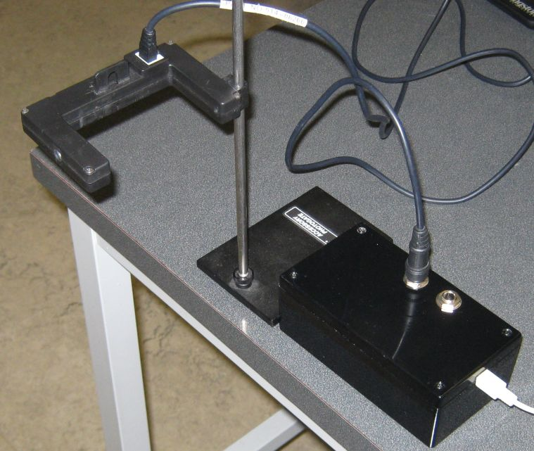

# Photogate Box Xpress 

Planning to port this project to a different MCU and use a different display. This moves are intended to bring the project forward with new parts and 
make simplify construction. The old project was built using the now oblolete peripheral libraries. The OLED display was small. We are generally now using an
I2C alphenumeric display in a 16x2 format rather than a graphical display that never caught on here.

The changes will be extensive so I will use a new repository I think. I will start with the working files from this repository.

# Photogate Box

The prototype of the photogate timer box with built in termanal. 

The PIC18F2620 is part of the timing circuit which is mounted on the top board of this image showing all
mounted parts.

The photogate box contains two interconnected circuits. The display terminal circuit and the PIC timer circuit.

## The PIC Timer Circuit

The side by side images are of the PIC timer circuit photo and the PIC pin assignments.

  

### Switch wiring and Power wires

  

## The Display Terminal Circuit

The display terminal circuit is shown 
here. Text and control characters is sent from the timer circuit to the terminal circuit
by the USART at 115200 bps. A list of control characters recognized is given at the link:

* [https://danpeirce.github.io/2018/oled-v1.2/oled-v1.2.html#command-codes-to-control-the-display-terminal](https://danpeirce.github.io/2018/oled-v1.2/oled-v1.2.html#command-codes-to-control-the-display-terminal)

This version of the photogate box contains two [custom 3D printed mounting brackets](https://github.com/danpeirce/pic-box-bracket) to secure the circuit boards to the box
lid.

## Cycle Modes

When powered up the timer display is initially blank and then shows two splash screens in succession. The first
is the **Adafruit Splash Screen** included with the [OLED library](https://danpeirce.github.io/2018/oled-v1.2/oled-v1.2.html#switching-to-current-adafruit-libraries-may-20-2018) that runs on the terminal
[forked on github](https://github.com/danpeirce/Adafruit_SSD1306/tree/terminal) for this project. The second splash screen shown after the first is the
**KPU Photogate Timer** splash screen. After the Photogate timer 
splash screen the displays the first mode option. The fist mode option is the Stopwatch mode. One can cycle through 
the display modes by pressing the **Mode Cycle/Reset** button. 

1. Stopwatch
2. Pulse
3. Pendulum
4. Gate
5. Picket Fence 1

When the timer box is powered up window 1 of the display will cycle displaying possible mode selections in a 
repeating sequence. The **Mode Cycle/Reset** button will advance the displayed mode. The **mode select** 
button allows one to select the mode.  

### Stopwatch mode

When the Stopwatch mode is selected the **mode select** button becomes the Start/Stop button.
During timing window 2 of the display shows a running approximation of elapsed time..
When timing is stopped the actual elapsed time will be displayed in window 2. Time is reset automatically if/when 
the Start/Stop button is pressed again.
The Mode Reset button will restart the timer so that a new mode can be selected.

### Pulse mode

The Pulse mode will time the duration between falling edges on the 
photogate #1 input. If/when new edges are detected the old time will be overwritten. Reset button
will return to mode select state **modeS**.

It is not always desirable to have the current time overwritten with new times when new edges are detected. if the mode select button 
is pressed a second time **Single Run** will be displayed in window one above the selected mode. When **Single Run** is active the mode
must be selected again to have new measurements made.    

### Pendulum mode

The Pendulum mode is similar to Pulse mode but it displays the total period of a swinging pendulum. This requres three falling edges.

If/when new edges are detected the old time will be overwritten. Reset button
will return to mode select state **modeS**.

It is not always desirable to have the current time overwritten with new times when new edges are detected. if the mode select button 
is pressed a second time **Single Run** will be displayed in window one above the selected mode. When **Single Run** is active the mode
must be selected again to have new measurements made.  

### Gate mode

The Gate mode times the duration from falling edge to rising edge. 

If/when new edges are detected the old time will be overwritten. Reset button
will return to mode select state **modeS**.

It is not always desirable to have the current time overwritten with new times when new edges are detected. if the mode select button 
is pressed a second time **Single Run** will be displayed in window one above the selected mode. When **Single Run** is active the mode
must be selected again to have new measurements made. 

### Picket Fence 1

This mode measures the duration between the first falling edge (the trigger point) and each of eight subsequent 
falling edges. Once triggered the display shows approximate running time until eight edges have been captured. 
Once the times have been captured one can cycle through the times with the mode cycle button. 
The select/start/stop button will allow the timer to watch for a new trigger.

## State Transition Diagram

This State Transition Diagram show the explicit states and transition conditions.

The modeS allows the selection of mode. In the modeS state SW1 functions as a cycle state switch
rather than a reset switch. The transition diagram is redrawn here to show the internal states 
of the modeS.

## breadboard 

Initial assembly was done on a breadboard.

Notes specific for this branch are at:

* [https://danpeirce.github.io/2018/oled-v1.2/oled-v1.2.html#pickmode2620](https://danpeirce.github.io/2018/oled-v1.2/oled-v1.2.html#pickmode2620)

The Photogate box includes a microcontroller with built-in hardware timers.

This branch is for the PIC18F2620 MCU. This branch uses an external 32 Mhz oscillator.

## Previous Project

The prototype from 2014 looked like this and had a USB interface and no display.

## Source code in C

The source code for this project is in C and is licensed under the [GNU GPL v3](http://www.gnu.org/licenses/gpl-3.0.txt).

## PIC Wiring

The PIC inputs and outputs as defined in the source code.

## Microchip Documents

* [Links to Microchip Documents and Install files](doc/MicrochipDocs.md)

## Legacy Peripheral libraries

* When installing xc8 on new computer the legacy peripheral libraries must also be downloaded and installed for 
  this project. The Plib is a separate download starting with XC8 version 1.35.
  
* MPLAB-8:  **Project > Build Options > Project**, select **Linker tab**, and under Runtime options check **Link in 
  Peripheral Library.**
  
* Also add the path to the location of the peripheral libraries.
